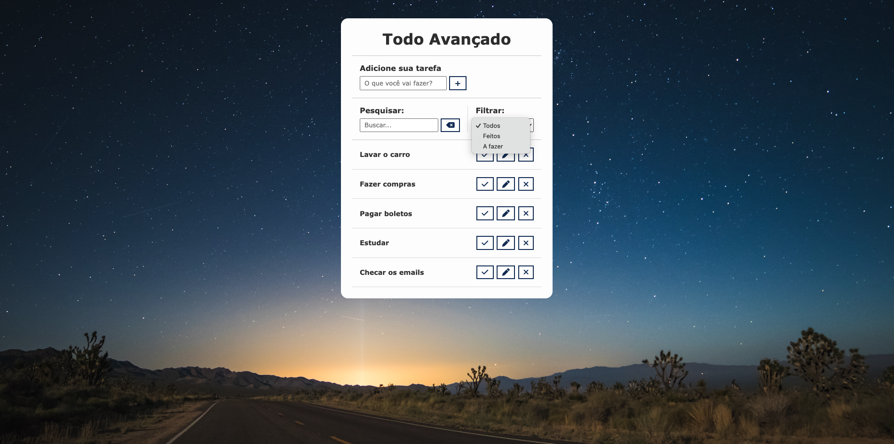

# Advanced To-Do List Project with Local Storage PT
Description:

Embarking on my journey as a student developer, I embarked on the exciting challenge of building an advanced to-do list application. This project not only showcases my growing skills but also highlights my dedication to learning and applying web development concepts.

In this hands-on project, I took significant strides in web development, harnessing HTML, CSS, and JavaScript to craft a feature-rich to-do list. While I may not be a seasoned pro just yet, I'm thrilled to share some of the key highlights of this endeavor:

Local Storage Magic: Through experimentation and learning, I integrated local storage capabilities into the application, allowing users to preserve their to-do lists across sessions. It's a small step toward creating more reliable and user-friendly web applications.

Exploring Search and Filtering: My journey involved diving into the world of search and filtering functionalities, making it easier for users to navigate their tasks. These features may not be perfect, but they reflect my commitment to improving user experiences.

User-Centric Interface: With an eye on enhancing usability, I crafted a user-friendly interface that adapts to various devices and screen sizes. It's my way of showing that I'm striving for designs that make sense to users.

Dynamic Editing Adventures: I embraced the challenge of enabling users to edit tasks seamlessly, learning valuable lessons about dynamic content modification in the process.

Accessibility Aspiration: While I'm still learning about accessibility, I've taken initial steps by incorporating ARIA attributes and testing with screen readers. My aim is to make web applications that are inclusive and welcoming to all users.

This to-do list project reflects my journey as a student developer, where learning by doing is my mantra. I invite you to explore this project, warts and all, as a testament to my growth and commitment to improving my skills. Your feedback and support are incredibly valuable as I continue on this exciting path of web development.

 

